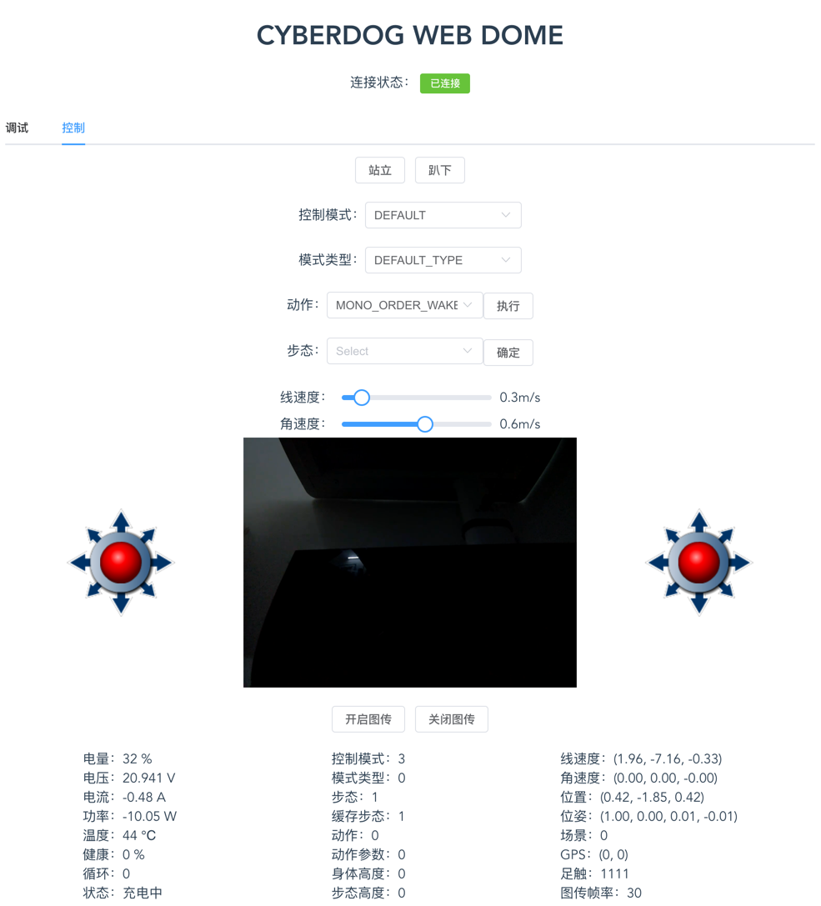

# cyberdog_web_control



1、需要安装rosapi、rosbridge

2、运行以下两个节点

ros2 run rosapi rosapi_node

ros2 run rosbridge_server rosbridge_websocket


## Project setup
```
npm install
```

### Compiles and hot-reloads for development
```
npm run serve
```

### Compiles and minifies for production
```
npm run build
```

### Run your unit tests
```
npm run test:unit
```

### Run your end-to-end tests
```
npm run test:e2e
```

### Lints and fixes files
```
npm run lint
```

### Customize configuration
See [Configuration Reference](https://cli.vuejs.org/config/).
